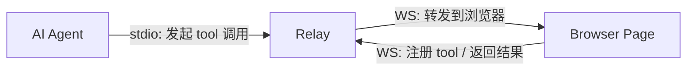
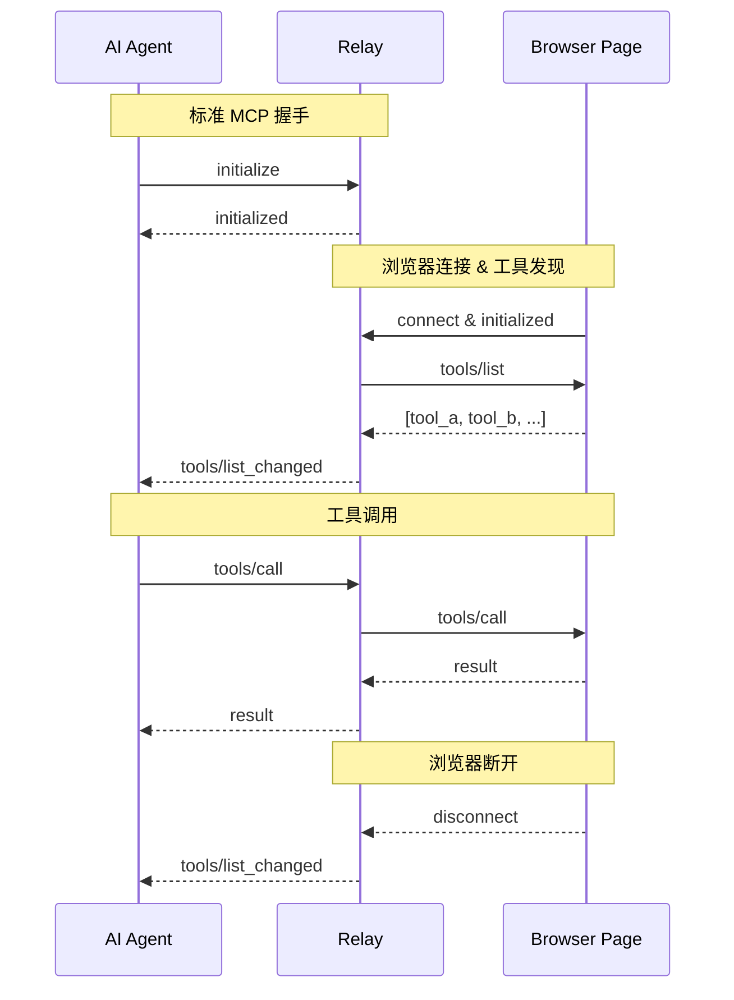

## WebMCP：把 MCP 拉进浏览器

Agent 与网页交互，过去只有两条路。

**DOM 模拟执行。** Agent 解读页面结构，模拟点击和输入。多步操作，一步错全链断。更致命的是语义问题——Agent 无法从 DOM 区分两个功能不同但长得一样的按钮。

**后端 MCP 集成。** 在服务端写 MCP Server，Agent 直接调 API。绕开了 DOM，但也绕开了用户——操作过程不可见、不可干预。同一套能力，两套接入层。

WebMCP 给出第三条路：网页在浏览器里声明 tool，浏览器内置 Agent 发现并调用。不猜 DOM，不走后端。

### 能力

- **结构化发现**：Agent 自动发现页面注册的 tool 及其参数/返回值定义，不再靠 DOM 猜测语义
- **人机共享上下文**：tool 在页面上公开执行，用户可见、可干预
- **可靠执行**：一步 tool 调用替代多步 DOM 模拟，消除累积误差

<Callout title="📱 同一范式：Android App Functions">
Android 的 [App Functions](https://developer.android.com/ai/appfunctions?hl=zh-cn) 采用相同思路——应用声明能力，系统 Agent 调度，界面始终在用户掌控下。WebMCP 是这一范式在 Web 平台的实现。详见 [Chrome WebMCP 文档](https://developer.chrome.com/docs/ai/webmcp?hl=zh-cn)。
</Callout>

但 WebMCP 有个现实尴尬：它绑死了 Chrome 149+ 和 Origin Trial，外部 Agent（OpenCode、Claude Code 等）也调不了浏览器内置的 tool 发现。

## webmcp-polyfill：自己实现一套

想法很直接——在规范全面落地前，让网页能以 MCP 的方式暴露 tool。只有一个障碍：MCP Server 需要 `listen(port)`，浏览器沙箱不允许。

**问题可以反过来解。** 浏览器不需要 listen，它只需要 connect。谁 listen？一个薄 relay。

### 核心架构：Relay 监听，浏览器反连

Relay 居中，一侧以 stdio 对接 Agent，扮演标准 MCP Server；另一侧以 WebSocket 连接浏览器页面。Agent 发起的 tool 调用由 Relay 转发到浏览器执行，浏览器注册的 tool 也通过 Relay 回传给 Agent 发现。

这解决了浏览器不能监听端口的问题：把 Server 角色从浏览器挪到 Relay，浏览器只做被动的 WS client。

### 连接生命周期

架构反连之后，MCP 协议的角色和流程跟着变了。Relay 同时参与两套对话——stdio 那头是标准 MCP Server，WS 那头是自定义 JSON-RPC。

按生命周期阶段对比：

| 阶段 | 标准 MCP | webmcp-polyfill |
|------|----------|-----------------|
| 握手 | Agent → Server 发起 `initialize` | Agent ↔ Relay 标准 MCP 握手；浏览器连入后独立向 Relay 发送 `initialized` 通知 |
| 工具发现 | Agent 调用 Server 的 `tools/list` | Relay 向浏览器发起 `tools/list`，合并本地与远端工具后呈现给 Agent |
| 工具调用 | Agent → Server 本地执行 | Agent → Relay → 浏览器执行 → Relay → Agent |
| 列表变更 | Server 自行决定何时发 `tools/list_changed` | 浏览器随时可增删工具，变更后通知 Relay 触发 `tools/list_changed` |
| 断连 | Agent 断开，Server 清理 | 浏览器断开 → Relay 注销工具并通知 Agent；Agent 断开走标准 MCP 流程 |

## 相比 Chrome 原生 WebMCP

不是替代，是补充——解决 Chrome 原生方案当前覆盖不到的场景：

- **跨浏览器**：不绑死 Chrome，任何支持 WebSocket 的浏览器都能用
- **外部 Agent**：OpenCode、Claude Code 等主流编码 Agent 可直接调用网页 tool
- **支持 headless**：不依赖可见标签页，Chrome 原生 WebMCP 做不到
- **零浏览器依赖**：`BrowserMCPHost` 只依赖原生 `WebSocket`，可直接从 CDN import 或打包进任意前端项目
- **传输解耦**：工具定义与传输层分离，未来有了浏览器内置 MCP transport 可无缝切换

## 拓展：应用场景与当前问题

运营 Agent 可以通过 polyfill 操作低代码搭建平台——从数据源拉商品信息、生成活动模板、预览后发布。对比多次投放数据后，还能挑出转化最好的版本直接复用。

relay 架构本身也带来了几个结构性代价吧。

1. 每次 tool 调用都要多跳一次，比 Chrome 原生直连多一层延迟和失败面。relay 与浏览器之间的协议是自定义的（`initialized` / `tools/list_changed`），离开 polyfill 生态没人认识。

2. 安全上 relay 监听 localhost 端口，任何本地进程都能连上冒充浏览器注册工具——后续可以加身份令牌补齐。

<ShareCard
  channel="github"
  title="eggyShrimp/webmcp-polyfill"
  description="让网页以 MCP 方式暴露 tool 的浏览器端 polyfill"
  url="https://github.com/eggyShrimp/webmcp-polyfill"
  meta="MIT"
/>
