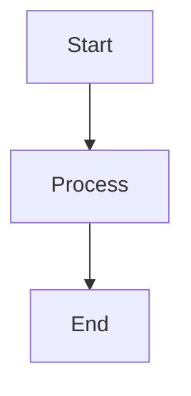

# Spec: Mermaid Rendering

在浏览器中将 MDX 中的 mermaid 代码块渲染为 SVG 图示。

## 输入

在 MDX 文件中使用 fenced code block，语言标记为 `mermaid`：

````markdown

````

## 编译时行为

- remark 插件将 `{ type: "code", lang: "mermaid" }` 节点转换为 `mdxJsxFlowElement`，输出 `<Mermaid chart="..." />`
- 编译后 HTML 中不包含原始 mermaid 代码文本和 `<pre class="language-mermaid">`

## 浏览器行为

- 页面挂载时，`<Mermaid>` 组件动态 `import("mermaid")` 加载 mermaid 库
- 加载完成后调用 `mermaid.render(id, chart)` 生成 SVG
- 渲染前显示空占位（`min-height: 100px`），无布局跳动
- 渲染失败时展示原始 `<pre><code>` 代码块

## 主题

- SVG 使用 warm paper 配色，通过 Mermaid 的 `themeVariables` 配置
- 字体使用 Courier Prime + PingFang SC monospace 栈

## 桌面端

- SVG 最大宽度为内容区宽度（`max-width: 100%`）

## 移动端

- 图表容器 `overflow-x: auto`，复杂图表可横向滚动

## 交互

- 无交互——纯静态 SVG
- 无 hover、click、动画

## 边界

- 仅处理 `lang: "mermaid"` 的代码块
- JS 禁用时图区显示空占位，不降级展示原始代码
- Mermaid 库通过动态 `import()` 按需加载，不影响无图页面
