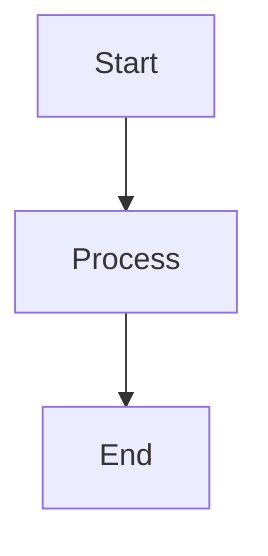

# Spec: Mermaid Rendering

构建时将 MDX 中的 mermaid 代码块预渲染为静态 SVG。

## 输入

在 MDX 文件中使用 fenced code block，语言标记为 `mermaid`：

````markdown

````

## 行为

- **编译时转换**：在 `@mdx-js/mdx` 的 `compile()` 阶段，rehype 插件将 `<code class="language-mermaid">` 替换为包含内联 SVG 的 `<div class="mermaid-diagram">`
- **主题**：SVG 使用 warm paper 配色，与博客整体视觉一致
- **唯一 ID**：每个 mermaid 图分配唯一标识符（如 `mermaid-<counter>`），避免多图冲突
- **降级**：若 mermaid 语法无效，保留原始 `<pre><code>` 块不做转换

## 桌面端

- SVG 最大宽度为内容区宽度（`max-width: 100%`）
- SVG 内文本使用 Courier Prime 等 monospace 字体
- 如有标题/说明文字，通过 MDX 中的普通文本在图表前后书写

## 移动端

- 图表容器 `overflow-x: auto`，复杂图表可横向滚动
- 不缩放图表本身（保持可读性）

## 交互

- 无交互——纯静态 SVG
- 无 hover、click、动画

## 边界

- 仅处理 `language-mermaid` class 的代码块，不处理其他图示语言
- Mermaid 版本锁定主版本号，不自动升级
